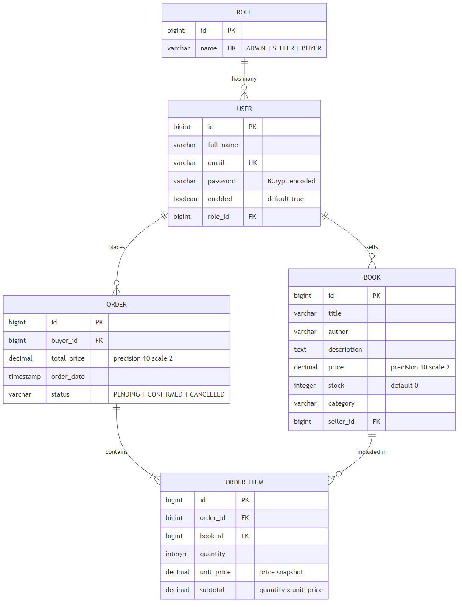
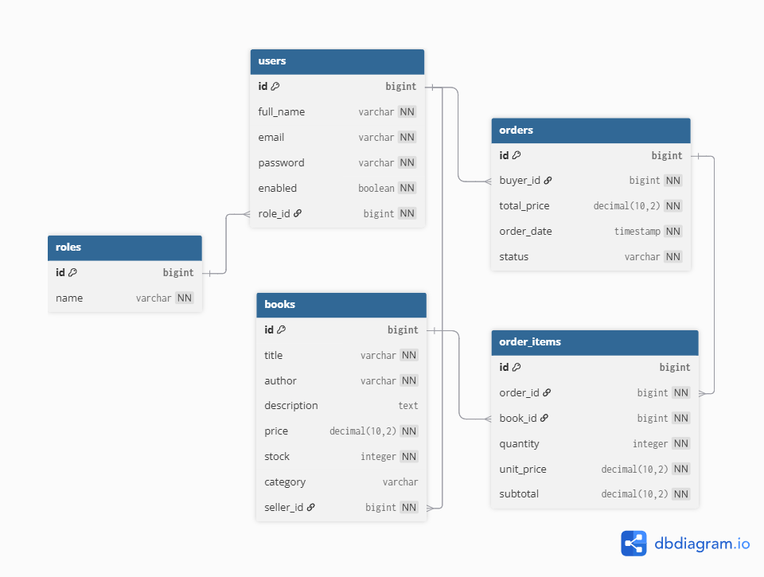
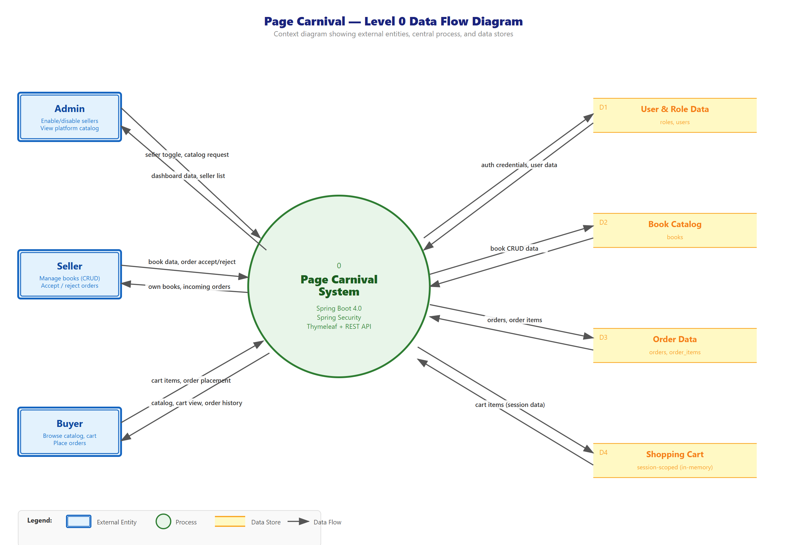

# Page Carnival

Page Carnival is a full-stack book marketplace platform built with Spring Boot, PostgreSQL, Thymeleaf, and Docker. The platform allows users to browse books, manage listings, and purchase books through a secure role-based system with three distinct roles: Admin, Seller, and Buyer.

Developed as part of the Software Engineering Lab course (CSE 3220) to demonstrate a complete professional software development workflow.

---

## Team Members

- Rysul Aman Nirob
- Biposhayan Chakma

---

## Live Demo

- **Deployed URL:** [https://page-carnival.onrender.com](https://page-carnival.onrender.com)
- **GitHub Repository:** [https://github.com/Nirob2107092/page-carnival](https://github.com/Nirob2107092/page-carnival)

---

## Tech Stack

| Layer      | Technologies                                               |
| ---------- | ---------------------------------------------------------- |
| Backend    | Java 17, Spring Boot 4.0, Spring Security, Spring Data JPA |
| Frontend   | Thymeleaf, HTML, CSS, JavaScript                           |
| Database   | PostgreSQL 15, H2 (testing)                                |
| DevOps     | Docker, Docker Compose, GitHub Actions                     |
| Testing    | JUnit 5, Mockito, SpringBootTest, MockMvc                  |
| Deployment | Render                                                     |

---

## System Architecture

The application follows a layered architecture pattern:


---

## Architecture Diagram


---

**Controllers breakdown (9 total):**

| Type     | Controllers                                                                            | Count |
| -------- | -------------------------------------------------------------------------------------- | ----- |
| REST API | ApiBookController, ApiCartController, ApiOrderController                               | 3     |
| MVC      | HomeController, BookController, CartController, OrderController, SellerOrderController | 5     |
| Auth     | AuthController                                                                         | 1     |

Spring Security handles authentication via form login and HTTP Basic, with role-based access control enforced at both URL-level (`SecurityConfig`) and method-level (`@PreAuthorize`).


## ER Diagram



### Schema Diagram




### Relationships

| Relationship      | Type         | Description                                                                         |
| ----------------- | ------------ | ----------------------------------------------------------------------------------- |
| Role → User       | One-to-Many  | One role can have many users                                                        |
| User → Book       | One-to-Many  | One seller can list many books                                                      |
| User → Order      | One-to-Many  | One buyer can place many orders                                                     |
| Order → OrderItem | One-to-Many  | One order contains many items (Cascade ALL, orphanRemoval)                          |
| Book → OrderItem  | One-to-Many  | One book can appear in many order items                                             |
| Order ↔ Book      | Many-to-Many | Resolved through `order_items` join entity (carries quantity, unit price, subtotal) |

### Database Schema

| Table         | Key Columns                                                                                |
| ------------- | ------------------------------------------------------------------------------------------ |
| `roles`       | id, name (`ADMIN` / `SELLER` / `BUYER`)                                                    |
| `users`       | id, full_name, email, password (BCrypt), enabled, role_id (FK)                             |
| `books`       | id, title, author, description, price, stock, category, seller_id (FK)                     |
| `orders`      | id, buyer_id (FK), total_price, order_date, status (`PENDING` / `CONFIRMED` / `CANCELLED`) |
| `order_items` | id, order_id (FK), book_id (FK), quantity, unit_price, subtotal                            |

---

## Data Flow Diagram (Level 0)



**External Entities:**

| Entity | Role | Data Sent to System | Data Received from System |
| ------ | ---- | ------------------- | ------------------------- |
| Admin  | Platform manager | Seller toggle requests, catalog view requests | Dashboard data (buyer/seller counts), seller list, full catalog |
| Seller | Book vendor | Book data (CRUD), order accept/reject decisions | Own book listings, incoming orders for their books |
| Buyer  | Customer | Cart items, order placement, catalog browse requests | Book catalog (enabled sellers only), cart view, order history |

**Data Stores:**

| ID | Store | Backing | Description |
| -- | ----- | ------- | ----------- |
| D1 | User & Role Data | `roles`, `users` tables | Authentication credentials, role assignments, enabled status |
| D2 | Book Catalog | `books` table | Book listings with title, author, price, stock, seller reference |
| D3 | Order Data | `orders`, `order_items` tables | Placed orders with status, line items with price snapshots |
| D4 | Shopping Cart | HTTP session (in-memory) | Session-scoped cart items, not persisted to database |

---

## API Endpoints

### Authentication (Public)

| Method | URL         | Auth | Description            |
| ------ | ----------- | ---- | ---------------------- |
| GET    | `/register` | None | Show registration form |
| POST   | `/register` | None | Register new user      |
| GET    | `/login`    | None | Show login page        |

### REST API -- Books

| Method | URL               | Auth          | Description                     |
| ------ | ----------------- | ------------- | ------------------------------- |
| GET    | `/api/books`      | Authenticated | List books from enabled sellers |
| GET    | `/api/books/{id}` | Authenticated | Get book by ID                  |
| POST   | `/api/books`      | SELLER        | Create a book                   |
| PUT    | `/api/books/{id}` | SELLER        | Update own book                 |
| DELETE | `/api/books/{id}` | SELLER        | Delete own book                 |

### REST API -- Cart

| Method | URL                        | Auth  | Description           |
| ------ | -------------------------- | ----- | --------------------- |
| GET    | `/api/cart`                | BUYER | View cart             |
| POST   | `/api/cart/items`          | BUYER | Add item to cart      |
| PATCH  | `/api/cart/items/{bookId}` | BUYER | Update item quantity  |
| DELETE | `/api/cart/items/{bookId}` | BUYER | Remove item from cart |
| DELETE | `/api/cart`                | BUYER | Clear cart            |

### REST API -- Orders

| Method | URL                | Auth  | Description         |
| ------ | ------------------ | ----- | ------------------- |
| POST   | `/api/orders`      | BUYER | Place order         |
| GET    | `/api/orders`      | BUYER | Get order history   |
| GET    | `/api/orders/{id}` | BUYER | Get order by ID     |
| PUT    | `/api/orders/{id}` | BUYER | Update order status |
| DELETE | `/api/orders/{id}` | BUYER | Delete order        |

### MVC -- Seller Book Management

| Method | URL                         | Auth   | Description             |
| ------ | --------------------------- | ------ | ----------------------- |
| GET    | `/seller/books`             | SELLER | List seller's own books |
| GET    | `/seller/books/create`      | SELLER | Show create form        |
| POST   | `/seller/books/create`      | SELLER | Create book             |
| GET    | `/seller/books/edit/{id}`   | SELLER | Show edit form          |
| PUT    | `/seller/books/edit/{id}`   | SELLER | Update book             |
| DELETE | `/seller/books/delete/{id}` | SELLER | Delete book             |

### MVC -- Seller Orders

| Method | URL                               | Auth   | Description                             |
| ------ | --------------------------------- | ------ | --------------------------------------- |
| GET    | `/seller/orders`                  | SELLER | View incoming orders for seller's books |
| POST   | `/seller/orders/{orderId}/accept` | SELLER | Accept pending order                    |
| POST   | `/seller/orders/{orderId}/reject` | SELLER | Reject pending order                    |

### MVC -- Buyer Cart and Orders

| Method | URL                           | Auth  | Description        |
| ------ | ----------------------------- | ----- | ------------------ |
| GET    | `/buyer/cart`                 | BUYER | View cart page     |
| POST   | `/buyer/cart/add`             | BUYER | Add to cart        |
| PATCH  | `/buyer/cart/update`          | BUYER | Update cart item   |
| DELETE | `/buyer/cart/remove/{bookId}` | BUYER | Remove from cart   |
| DELETE | `/buyer/cart/clear`           | BUYER | Clear cart         |
| POST   | `/buyer/orders/place`         | BUYER | Place order        |
| GET    | `/buyer/orders/history`       | BUYER | View order history |

### MVC -- Dashboards

| Method | URL                          | Auth   | Description                                  |
| ------ | ---------------------------- | ------ | -------------------------------------------- |
| GET    | `/`                          | None   | Home page                                    |
| GET    | `/admin/dashboard`           | ADMIN  | Admin dashboard                              |
| GET    | `/admin/catalog`             | ADMIN  | View full platform catalog                   |
| POST   | `/admin/sellers/{id}/toggle` | ADMIN  | Enable/disable a seller                      |
| GET    | `/seller/dashboard`          | SELLER | Seller dashboard                             |
| GET    | `/buyer/dashboard`           | BUYER  | Buyer dashboard                              |
| GET    | `/buyer/catalog`             | BUYER  | Buyer-visible catalog (enabled sellers only) |

---

## Run Instructions

### Prerequisites

- Java 17+
- Docker and Docker Compose
- Git

### Run with Docker (Recommended)

```bash
# Clone the repository
git clone https://github.com/Nirob2107092/page-carnival.git
cd page-carnival

# Create .env file from the example
cp .env.example .env
# Edit .env with your preferred database credentials

# Build and start the application
docker compose up --build
```

The application will be available at `http://localhost:8080`.

### Default Admin Credentials

| Email                  | Password |
| ---------------------- | -------- |
| admin@pagecarnival.com | admin123 |

These are seeded automatically on first startup via `DataLoader`.

### Run Locally (Without Docker)

```bash
# Ensure PostgreSQL is running locally with a database named page_carnival

# Set environment variables
export DB_URL=jdbc:postgresql://localhost:5432/page_carnival
export DB_USERNAME=postgres
export DB_PASSWORD=your_password

# Build and run
./mvnw clean install
./mvnw spring-boot:run
```

### Run Tests

```bash
./mvnw test
```

Tests use an in-memory H2 database (configured in `src/test/resources/application.properties`) and require no external setup.

---

## Testing

### Unit Tests (Service Layer)

| Test Class             | Tests | What It Covers                                                          |
| ---------------------- | ----- | ----------------------------------------------------------------------- |
| `AuthServiceImplTest`  | 3     | Registration, duplicate email detection, password encoding              |
| `BookServiceImplTest`  | 6     | CRUD operations, not-found handling                                     |
| `CartServiceImplTest`  | 5     | Add/update/remove items, book-not-found                                 |
| `OrderServiceImplTest` | 5     | Order placement, empty cart rejection, stock validation, status updates |

### Integration Tests (Controller Layer)

| Test Class                         | Tests | What It Covers                                                        |
| ---------------------------------- | ----- | --------------------------------------------------------------------- |
| `ApiBookControllerIntegrationTest` | 3     | GET /api/books (authenticated + unauthenticated), GET /api/books/{id} |
| `ApiCartControllerIntegrationTest` | 3     | GET /api/cart, role-based denial, POST /api/cart/items                |
| `AuthControllerIntegrationTest`    | 3     | POST /register, GET /register, GET /login                             |

Integration tests use `@SpringBootTest` + `@AutoConfigureMockMvc` with a real Spring context, security filter chain, and H2 test database.

### Current Status

- Unit tests: **19 passed** (4 classes)
- Integration tests: **9 passed** (3 classes)
- Total: **29 tests, 0 failures**
- Additional test class: `PageCarnivalApplicationTests` (**1** context-load test)
- Test stack: JUnit 5, Mockito, SpringBootTest, MockMvc
- CI also executes tests in `.github/workflows/ci.yml`

---

## CI/CD Pipeline

The project uses GitHub Actions for continuous integration and deployment. The workflow is defined in `.github/workflows/ci.yml`.

### Trigger Events

- Push to `main`, `dev`, or `feature/*` branches
- Pull requests targeting `dev` or `main`

### Pipeline Jobs

#### Job 1: Build & Test (`build`)

1. **Checkout** -- clone the repository
2. **Setup Java 17** -- Temurin distribution with Maven caching
3. **Build** -- `./mvnw clean install -DskipTests`
4. **Test** -- `./mvnw test` (unit + integration tests)
5. **Docker Build** -- `docker build -t page-carnival-app .` (validates the Dockerfile)
6. **Artifact Upload** -- uploads Surefire test reports on failure for debugging

#### Job 2: Deploy to Production (`deploy-prod`)

- **Runs only on:** push to `main` branch
- **Depends on:** `build` job passing
- **Action:** triggers Render deploy hook via `RENDER_DEPLOY_HOOK` secret

### Branch Strategy

| Branch      | Purpose                                                                       |
| ----------- | ----------------------------------------------------------------------------- |
| `main`      | Production-ready code (protected, requires PR + review)                       |
| `dev`       | Development integration branch                                                |
| `feature/*` | Individual feature branches (e.g., `feature/seller-ownership-admin-controls`) |

No direct pushes to `main`. All changes go through pull requests with at least one review approval.

---

## Dockerization

### Dockerfile

Multi-stage build for minimal image size:

- **Stage 1 (Build):** Uses `maven:3.9.9-eclipse-temurin-21` to compile and package the application
- **Stage 2 (Runtime):** Uses `eclipse-temurin:21-jre` (lightweight JRE) to run the JAR

### Docker Compose

Two services orchestrated via `docker-compose.yml`:

| Service    | Image                 | Port | Purpose                 |
| ---------- | --------------------- | ---- | ----------------------- |
| `app`      | Built from Dockerfile | 8080 | Spring Boot application |
| `postgres` | postgres:15           | 5432 | PostgreSQL database     |

All credentials are passed via environment variables from a `.env` file (see `.env.example`). No secrets are hardcoded.

---

## Project Structure

```
page-carnival/
  src/main/java/com/pc/pc/
    config/           -- DataLoader (role + admin seeding)
    controller/       -- 9 controllers (3 REST + 5 MVC + 1 Auth)
    dto/              -- 9 Data Transfer Objects
    exception/        -- 4 custom exceptions + 2 global handlers (MVC + REST)
    model/            -- 5 JPA entities + 2 enums
    repository/       -- 5 Spring Data JPA repositories
    security/         -- SecurityConfig, CustomUserDetails, SuccessHandler
    service/          -- 4 service interfaces + implementations
  src/main/resources/
    templates/        -- 16 Thymeleaf HTML templates
    application.properties
    application.yml
  src/test/
    java/com/pc/pc/
      controller/     -- 3 integration test classes (9 tests)
      service/        -- 4 unit test classes (19 tests)
    resources/
      application.properties  -- H2 test config
  Dockerfile
  docker-compose.yml
  .github/workflows/ci.yml
  .env.example
```

---

## Key Features

- **Role-based access control:** ADMIN, SELLER, BUYER with URL-level and method-level security
- **Seller ownership enforcement:** Sellers can only view/edit/delete their own books
- **Admin seller management:** Admin can enable/disable seller accounts from dashboard
- **Buyer visibility filtering:** Catalog shows only books from enabled sellers
- **Seller order workflow:** Sellers can view incoming orders and accept/reject them
- **Hardened registration:** Public registration allows only BUYER and SELLER; ADMIN self-registration is blocked
- **Session-scoped cart:** In-memory shopping cart per user session
- **Price snapshots:** `unit_price` captured at order time, independent of future price changes
- **Global exception handling:** Separate handlers for MVC (error pages) and REST (JSON responses)
